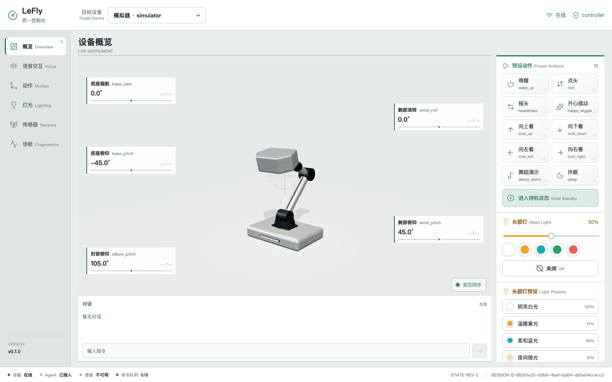

# LeFly Agent

English | [简体中文](README.zh-CN.md)

**A desktop body for AI agents.**

LeFly Agent is an open-source desktop embodied agent platform for AI education, makers, and physical-agent prototyping. The `v0.1.0` source Alpha runs without physical hardware: Simulator Lite provides motion, lighting, sensors, and device state, while the browser Console and Text Agent provide two control paths.



## What you can build

- Control a five-joint virtual desktop robot from a browser.
- Use deterministic text commands or an optional LLM to trigger motion and head-light behavior.
- Inject touch, gesture, and face events to prototype nearby interaction.
- Build protocol-compatible clients and device endpoints with the Python SDK.

## Who it is for

- Educators and students exploring AI agents, robotics, and embodied interaction;
- Agent and AI-hardware developers prototyping physical behavior; and
- Makers, hackers, and desktop-robot researchers building extensible demos.

## Included in v0.1.0

- Versioned LeFly Device Protocol v1 contracts and fixtures.
- Async Python SDK for Simulator and future conforming adapters.
- Simulator Lite with packaged Web Console, five joints, actions, lights,
  status rendering, virtual sensors, and diagnostics.
- Deterministic text control and optional LiveKit-backed LLM tools.
- Automated protocol, integration, browser, visual, and release checks.

Voice, physical adapters, hardware design files, and education course material
are not included in this Alpha. This is developer and education software, not a
finished consumer companion robot or a supported physical hardware kit. An
[experimental LeFly hardware kit preview and non-binding interest survey](docs/hardware-preview.md) show the direction being explored.

## Quickstart

Use Python 3.12 from the repository root:

```bash
python -m pip install --upgrade pip setuptools wheel
python -m pip install \
  packages/lefly-protocol \
  packages/lefly-sdk-python \
  packages/lefly-simulator \
  packages/lefly-agent
python -m lefly_simulator --host 127.0.0.1 --port 8766
```

Open `http://127.0.0.1:8766/`. The compiled Console is already included; Node
is needed only to rebuild or test the frontend.

For Text Agent setup and troubleshooting, follow the [complete quickstart](docs/quickstart.md).

## Architecture

```text
Browser Console -- Console Control --> Simulator / Device endpoint
Browser Console -- Agent Control ----> Text Agent -- Python SDK --> Device endpoint
```

The Browser is a client, not the simulated device. Direct controls do not pass through an LLM. Text input uses the Agent, whose robot tools call the same SDK used by other clients. Physical hardware belongs behind a separately distributed Device Protocol adapter.

Read the [architecture](docs/architecture.md) and [Device Protocol](docs/protocol.md) for the boundary details.

## Roadmap

The current Simulator uses built-in motion presets. Planned work includes a portable action format, CSV timeline import, and shared playback across the Simulator, Agent, and future physical-device adapters. Voice, physical-device, and visual-interaction work follows as separately accepted capabilities.

See the public [Roadmap](docs/roadmap.md) for current priorities and exploration areas.

## Documentation

- [Documentation index](docs/README.md)
- [Compatibility](docs/compatibility.md)
- [Python SDK](docs/sdk-python.md)
- [Simulator and Web Console](docs/simulator.md)
- [Text Agent](docs/text-agent.md)
- [Roadmap](docs/roadmap.md)
- [Hardware preview](docs/hardware-preview.md)

## Security

The current services are loopback development services without production authentication, authorization, or TLS. Do not expose them to an untrusted network. See [SECURITY.md](SECURITY.md).

## License

LeFly Agent is released under the [Apache License 2.0](LICENSE). See [NOTICE](NOTICE) and the [third-party notices](docs/third-party-notices.md).
