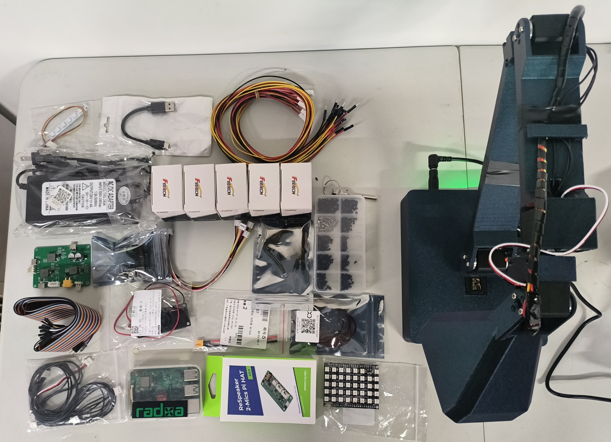

# Experimental Hardware Preview

English | [简体中文](zh-CN/hardware-preview.md)

The following image shows representative development parts and third-party modules used during prototyping. The coming prototype used for a future desktop embodied-agent kit explores a five-joint articulated lamp form with a head RGB light matrix, base status light strip, touch input, and local compute. Visible product names and trademarks belong to their respective owners and do not imply endorsement.

## Hardware interest survey

We are collecting non-binding feedback from developers, makers, and educators about future assembled and self-assembly kit directions. Your opinion to Lefly hardware kit is truly appreciated.

[Open the LeFly hardware interest survey on Feishu](https://fenfsn47cp.feishu.cn/share/base/form/shrcnAMVCBg1xI04GYlUGr9x6ce)

The QR code is a companion to the direct link above, not the only access path.

## Future direction

- physical LeFly adapter or hardware runtime;
- bill of materials;
- CAD source, STL, or 3MF files;
- schematics, PCB source, or Gerber files;
- wiring or assembly instructions;
- LeFly Edu delivery date, ordering link, and hardware support commitment.

A future hardware release would first need a tested software adapter, versioned
design files, provenance records, safety notes, assembly guidance, and a repeatable acceptance process. None of those materials is promised by this preview.

The current prototype is an experimental development device, not a certified consumer product. Future hardware software and its dependencies require a separate license review before distribution.
